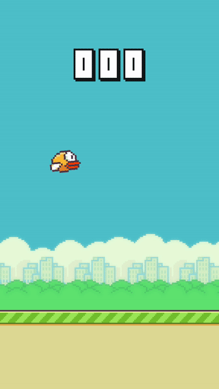

# Flappy-Flutter

Attempt to Clone the Flappy Bird Game Using Flutter

 

## Intro

This is a fun attempt to learn the more about the mobile framework.

If you remember, there was a game called Flappy Bird. At that time it was a best time killer app. I was a fan back in days. Anyway, it is not a full clone of the game. It's just repeating some basic mechanics and graphics.

The game has built on [Flutter](https://github.com/flutter/flutter) and [Flame](https://github.com/luanpotter/flame) game engine.

**Pros**:

- Dart: I had no idea that learning Dart would be so simple. The group did a fantastic job creating the language. For me, at least, it feels like something in between C++ and Java. Many others, I'm sure, will draw parallels with other popular languages like Python, Javascript, or the C-family in general. Remember, this isn't a coincidence. It was probably chosen specifically to make language switching as simple as possible. 

- Hot Reload: It's been the main feature for selling me that framework. It quickly loads all the new changes in the code and helps boost productivity.
  
- Command Line Interface: I have been using VSCode for Flutter and I have to admit, using CLI for interacting with the framework was a plus. I was able to solve my issues quick.

- User Interface: Working with the UI in Flutter is fantastic! You don't lean on Web based rendering (Hybrid platforms). From low-level GPU renders to UI elements, you have just your own rendering stack. In this instance, it is far faster than hybrid platforms, since platform SDKs and APIs (for UI rendering) are not a direct dependency.

**Cons**:

I can't think of any major issues with this framework. It's stable, has an amazing community, and is expanding more quickly than others. Perhaps just one item. As I mentioned before, I haven't touched many sections of the framework, but to the best of my knowledge, there are some problems with establishing versions yet maintaining null safety and interacting with native APIs. But I'm sure the community will come up with a fix for that.

PS: Don't judge me, It's my first "game" game. I've made a lot of mistakes in architecture and code.
